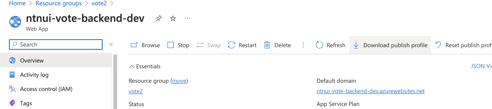

# Infrastructure

##### The [bicep-template](./azureInfrastructure.bicep) contains the infrastructure to run a production and development environment for this application in [Microsoft Azure](https://azure.microsoft.com/).

For deploying the app you have to follow these steps:

1. Download the Azure CLI (guide [here](https://learn.microsoft.com/en-us/cli/azure/install-azure-cli))
2. Log in to your preferred account using `az login`
3. Create a Resource Group for the application by the command (Change the name and the location if another is preferred):  
   `az group create --name vote --location "Norway East"`
4. Deploy the bicep template into the newly created Resource group by entering this command from this folder (replace name of resource group if another is used):
5. `az deployment group create --resource-group test --template-file ./infrastructure/azureInfrastructure.bicep`

Now you have all the resources set up, but there are still some manual steps:

1. Set up a custom domain

   The application has to be hosted on the same domain/subdomain for cookies and CORS to behave correctly.
   For example, the frontend can be assigned to vote.ntnui.no, then the backend has to run on a subdomain of the frontend. For example, api.vote.ntnui.no. This has to be configured manually in Azure.  
   (In the future this could probably be automated as well?)

2. Allow only the backend IP to access the database.

   Because the backend is dependent on the database to exist to obtain the database connection string, the database is created before the backend. Therefore the bicep script won't know the backend IP because it does not exist yet. By default, it there allows all IPs, which is not ideal security-wise.
   (You obviously still need the URI, username, and password)

### Deploying code from GitHub

##### Now that the infrastructure is up and running it's time to add some content ✨

This repository contains some [workflows](../.github/workflows/). The ones containing "deploy" deploys either the backend or the frontend to the development or the production environment.

In the backend workflows, you have to add the correct `app-name` and `slot-name`.
The backend workflows also contain an `publish-profile`. The publish profiles are stored in the secrets section of this GitHub repository. These secrets have to be updated with the new ones for the workflows to function.

The secret can be downloaded from here or by using Azure CLI.

It is almost the same for the frontend workflows, except here the workflow contains a `azure_static_web_apps_api_token`. You find this token almost the same way as the publish profile, but it is named `deployment token` in the Static Web App settings.

##### When all the above steps are completed, your next commit will automagically deploy to Azure, and the service are ready for production! 🚀

(If one day you do not need the service anymore, you only need to delete the resource group, and you are back to where you started 🧹)
